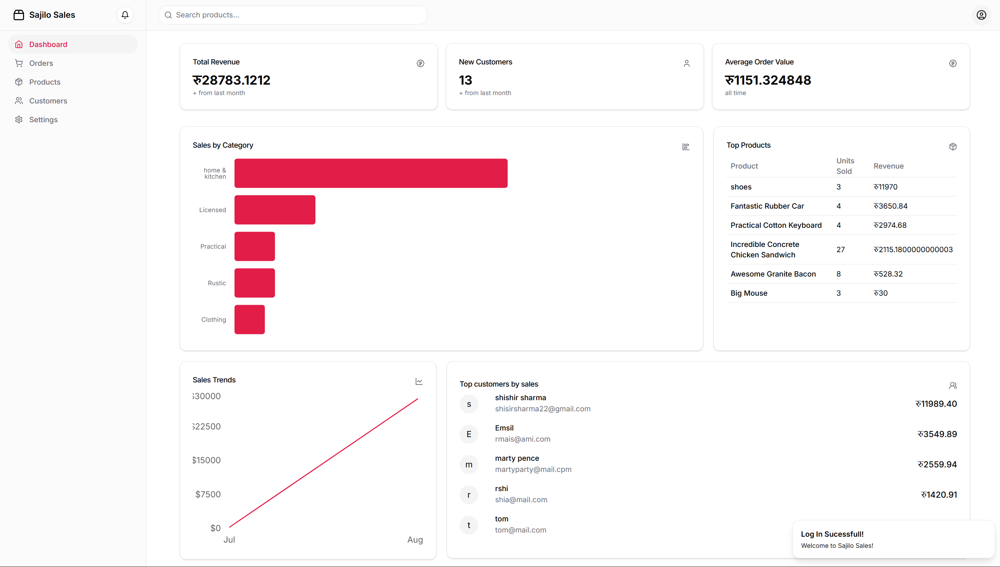

# Sajilo Sales - Frontend

Sajilo Sales is a frontend system for a Point of Sale (POS) application. It provides a user interface for managing sales transactions, products, customer data, and key metrics. The system interacts with a backend via RESTful API endpoints to perform POS functionalities.

## Features

### Admin

- **View Metrics**: Display key metrics and analytics.
- **CRUD Products**: Create, read, update, and delete products.
- **CRUD Orders**: Create, read, update, and delete orders.
- **CRUD Customers**: Create, read, update, and delete customers.

### Cashier

- **Create Customer**: Add a new customer.
- **Search Customers**: Search for customers by different feild.
- **Create Orders**: Create transactions.
- **Make Checkouts**: checkout the transaction.
- **View Products** View all the related products and their details.

## Technologies

- **Vite**: Fast build tool for modern web applications.
- **React**: JavaScript library for building user interfaces.
- **Shadcn**: Library for compiling and optimizing shaders.
- **Tailwind CSS**: Utility-first CSS framework for rapidly building custom user interfaces.

## API Integration

Integration with backend services using RESTful API endpoints to perform CRUD operations and other functionalities.

## Future Features

1. **Advanced Analytics**: Implementing more detailed analytics and reporting features to provide deeper insights into sales and customer behavior.
2. **Multi-language Support**: Adding support for multiple languages to cater to a broader audience.
3. **QR-based Payment**: Introducing QR-based payment options to streamline the checkout process and enhance user convenience.

## Challenges

1. **State Management**: Managing the state across different components and ensuring data consistency can be challenging, especially with complex user interactions and asynchronous data fetching.
2. **Performance Optimization**: Ensuring the application remains performant with a large number of products, orders, and customers. This includes optimizing rendering and minimizing unnecessary re-renders.
3. **Responsive Design**: Creating a responsive design that works seamlessly across various devices and screen sizes, ensuring a good user experience on both desktop and mobile.

## Environment Variables

To run this project, you will need to add the following environment variables to your .env file:

- `BASE_URL`: Base Url of Backend.

## Author

- **Name**: Shishir Sharma
- **ID**: 220099

## Apendix

### Feature 1: Dashboard

### Feature 2: Dashboard Dark

### Feature 3: Invoices

### Feature 4: Inventory

### Feature 5: Customers

### Feature 6: Settings

### Feature 7: Cashier

### Feature 8: Checkout

### Feature 9: Order-print

